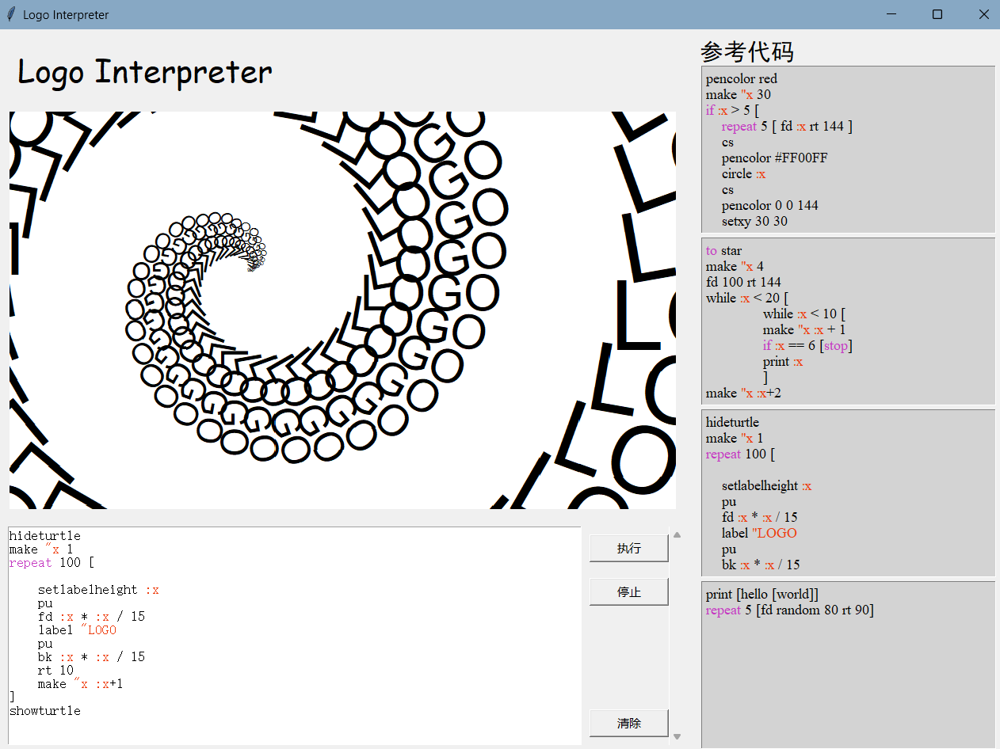

# LOGO语言解释器

## 项目概述

本项目是一个基于Python的LOGO语言解释器，它包括词法分析器、语法解析器、执行器和用户界面四个部分。用户可以通过文本编辑框输入LOGO代码，程序将代码解析并执行，最终在画布上绘制出相应的图形。

## 前置条件

- Python 3.x
- Tkinter库

## 运行方法

1. 克隆或下载本项目到本地。
2. 确保你的Python环境中已安装Tkinter库。
3. 在命令行中运行`python logo.py`启动程序。
4. 在文本编辑框中输入LOGO代码，点击“执行”按钮开始执行。
5. 你可以通过“停止”按钮随时停止程序的执行。
6. 执行完毕后，点击“清除”按钮可以清除画布上的内容。

## 关键特性

- 词法分析器：使用正则表达式和字符比较识别词法单元。
- 语法解析器：通过递归下降解析生成抽象语法树（AST）。
- 执行器：支持命令执行和程序控制流程，包括循环和条件语句。
- 用户界面：使用Tkinter构建简单直观的GUI，支持多线程执行以保持响应性。
  